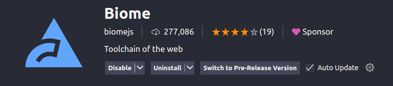

# 💰 Financial - Dashboard

Dashboard financeiro moderno, responsivo e multi-país, desenvolvido com **React 19**, **TypeScript** e **Vite**. Estruturado com Clean Architecture, foco em escalabilidade, qualidade e experiência do usuário.

---

## ✨ Destaques

- **Clean Architecture**: Separação clara de responsabilidades e camadas.
- **Padrões de Projeto**: Factory, Strategy, Repository, Dependency Inversion.
- **Internacionalização**: Suporte a múltiplos idiomas e países.
- **UI/UX Moderna**: Design responsivo, temas adaptativos, acessibilidade.
- **Testes Automatizados**: Cobertura de componentes, hooks e stores.
- **Qualidade de Código**: TypeScript estrito, ESLint/Biome, Prettier.

---

## 🛠️ Tecnologias Principais

- **React 19** & **TypeScript 5.8**
- **Vite 6** (build e dev server ultrarrápido)
- **Zustand** (estado global)
- **React Bootstrap** & **Bootstrap 5** (UI)
- **Chart.js** & **react-chartjs-2** (gráficos)
- **i18next** (internacionalização)
- **Vitest** & **Testing Library** (testes)
- **Biome** (lint e formatação)

---

## 📁 Estrutura de Pastas

```
src/
├── components/   # Componentes React reutilizáveis
├── factories/    # Implementação do Factory Pattern
├── hooks/        # Hooks customizados
├── languages/    # Configurações de idiomas
├── layouts/      # Layouts de página
├── mocks/        # Mocks e setup de testes
├── models/       # Modelos de domínio (TypeScript)
├── pages/        # Páginas da aplicação
├── services/     # Serviços de domínio e integrações
├── store/        # Estado global (Zustand)
├── tests/        # Testes unitários e utilitários
├── main.tsx      # Entry point da aplicação
├── App.tsx       # Componente raiz
```

---

## 🌍 Funcionalidades

- Multi-país e multi-idioma
- Criação e listagem de transações financeiras
- Gráficos de volume diário e saldos por moeda
- Interface responsiva e adaptativa por país
- Temas dinâmicos
- Internacionalização completa

---

## 🚀 Como Executar

### Pré-requisitos

- **Node.js** 22+
- **pnpm** 9+
- **Extensão do Biome para o VS Code** (https://marketplace.visualstudio.com/items?itemName=biomejs.biome)

### Instalação e Execução
Para rodar o dashboard localmente na sua máquina é muito simples:

1. Intale a extensão do biome no seu editor.


> A extensão é necessária pois utilizei o biomejs como linter, então para que as formatações ocorram quando salvar arquivos, é necessário instalar a extensão.

2. Baixe, instale as dependência e rode

```bash
# Clonar o repositório
git clone https://github.com/perrout/financial-dashboard.git
cd financial-dashboard

# Instalar dependências
pnpm install

# Rodar em modo desenvolvimento
pnpm dev

# Build para produção
pnpm build

# Visualizar build de produção
pnpm preview
```

---

## 🧪 Testes

- Testes unitários para componentes, hooks e stores.
- Cobertura de código com Vitest.

```bash
# Executar todos os testes
pnpm test

# Testes em modo watch
pnpm test:ui

# Gerar relatório de cobertura
pnpm test:coverage
```

---

## 📊 Qualidade e Convenções

- **TypeScript Strict Mode** habilitado
- **Biome** para lint e formatação
- **Prettier** integrado
- **100% Type Safety**
- **Clean Code** e boas práticas

---

## 🎨 UI/UX

- **Design System** baseado em Bootstrap 5 customizado
- **Responsividade**: Mobile-first
- **Acessibilidade**: ARIA labels e HTML semântico
- **Performance**: Code splitting e lazy loading
- **Internacionalização**: i18next

---

## 🚧 Roadmap / Próximos Passos

- Integração com API real
- Autenticação e autorização
- Relatórios avançados
- Notificações push
- Testes E2E

---

## 🤝 Contribuição

Contribuições são bem-vindas! Siga as convenções do projeto e abra um Pull Request.

---

Dúvidas? Sugestões? Abra uma issue!
